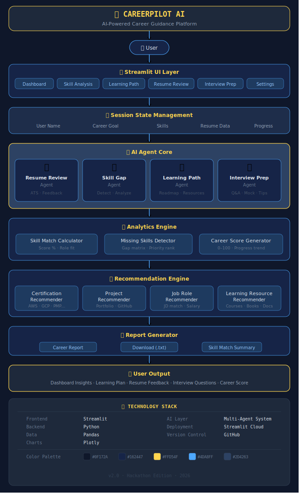

# CareerPilot AI

🚀 Live Demo:
https://careerpilot-ai-e6yuswhz6s5dzfd5uh7hr4.streamlit.app

## Features
- Skill Analysis Agent
- Learning Path Agent
- Portfolio Builder Agent
- Resume Review Agent
- Interview Preparation Agent
CareerPilot AI is a multi-agent career development assistant built using Microsoft AI technologies

## Problem

Students often struggle to identify skill gaps, create portfolios, improve resumes, and prepare for interviews.

## Solution

CareerPilot AI uses multiple AI agents that collaborate through multi-step reasoning to provide personalized career guidance.

## Technology Stack

- Python
- Microsoft Foundry
- AI Agents
- GitHub Copilot
- Machine Learning

## Future Scope

- Internship Recommendation
- Job Matching
- Certification Tracking
- Career Mentorship

# 🏗️ System Architecture

## CareerPilot AI Architecture

## Architecture

### Workflow

1. User enters skills, career goal, and resume.
2. Streamlit UI collects and manages data.
3. AI Agent Core performs analysis.
4. Analytics Engine calculates skill gaps and scores.
5. Recommendation Engine suggests learning paths and careers.
6. Report Generator creates downloadable reports.
7. Dashboard displays personalized insights.

---

### Technology Stack

- Frontend: Streamlit
- Backend: Python
- Data Processing: Pandas
- Visualization: Plotly
- AI Layer: Multi-Agent System
- Deployment: Streamlit Cloud
- Version Control: GitHub

## Impact

CareerPilot AI helps students become industry-ready through personalized guidance, skill-gap analysis, portfolio development, resume enhancement, and interview preparation.

## Future Enhancements

- Internship Recommendation Agent
- Job Matching Agent
- Real-time Career Mentor
- Certification Tracking
- LinkedIn Profile Analyzer
- AI Mock Interview System

 ## Demo

CareerPilot AI demonstrates multi-agent collaboration for:

- Skill Gap Analysis
- Learning Path Generation
- Portfolio Recommendations
- Resume Improvement
- Interview Preparation
